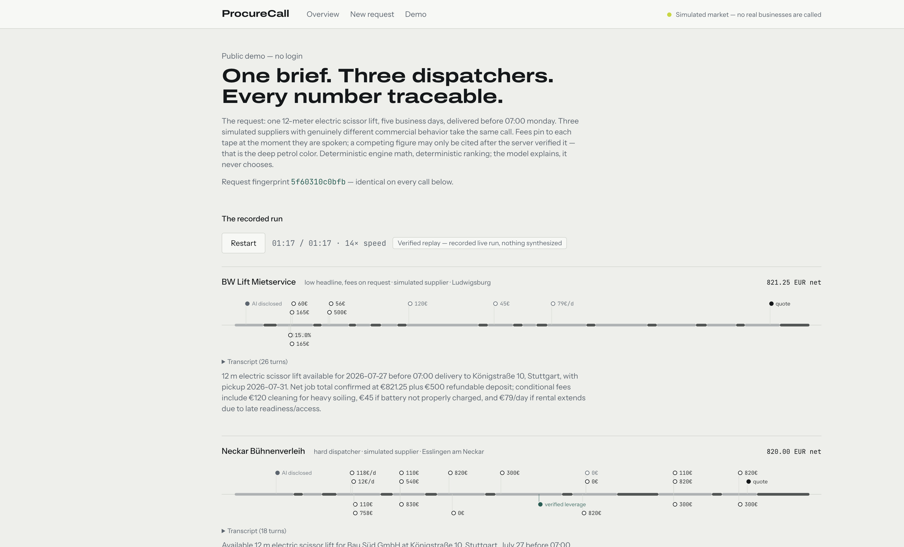

# ProcureCall



**A buyer-side voice procurement agent that can only cite numbers a server verified — one brief, every supplier, the best verified deal.**

**Live demo (no login): https://procurecall.vercel.app/demo**

**Demo video:** `submission/` (recorded from the live product at submission; scripts in this repo)

Built for the Hack-Nation 6th Global AI Hackathon — Challenge 01, *The Negotiator*
(ElevenLabs).

## The problem

Phone-priced markets punish whoever lacks time. A site manager who needs a 12-meter
scissor lift Monday at 07:00 would have to call six rental yards, describe the same
job six times, and compare quotes that are deliberately not comparable — one quotes a
day rate without delivery, another a weekly price with mandatory liability reduction,
a third refuses to name the deposit. He calls two, takes the first workable offer,
and overpays. These prices are not hidden; they are never written down. They exist
only while someone is speaking them.

## Product flow

1. **One brief.** Voice interview (ElevenLabs agent, discloses it is an AI) or
   document upload (PDF/photo) or typed text — all three produce the identical
   validated job spec.
2. **Confirm.** The user reviews every field, authorizes negotiation levers
   (reveal budget, accept pickup, commit up to a ceiling…), and confirms. The spec
   freezes under a SHA-256 fingerprint; edits create new versions. No supplier is
   called before confirmation — enforced server-side.
3. **The calls.** Three suppliers with genuinely distinct commercial behavior take
   the same brief: transparent premium, low headline with fees disclosed only when
   asked, hard dispatcher. Every fee is logged the second it is spoken and pinned to
   the call tape. Every call ends in a structured outcome: itemized quote, callback
   commitment, or documented decline.
4. **The close.** Verified leverage moves prices during calls. A deterministic
   engine computes totals and ranking with reason codes; every figure links back to
   the moment it was said.

## The truth layer

The buyer agent's **only** path to a competing figure is a server-side tool:

```ts
getVerifiedLeverage({ currentSpecFingerprint, quoteId })
// returns a figure only if: quote confirmed ∧ total present ∧ fingerprint matches
// ∧ transcript evidence exists ∧ not expired ∧ currency/tax compatible
```

Competing numbers are not in the system prompt, not in the conversation context, not
in any knowledge base. The model cannot cite a number it was never handed. The same
mechanism gates authority: an unauthorized lever's tool is absent from the session,
not merely discouraged. A post-call validator scans every transcript for commercial
claims and checks — in code — whether a tool call supported them.

In the recorded golden run this moved a quote from **895.00 € to 805.00 € net
(−10.1 %) during the call**, because a competing supplier's confirmed,
fingerprint-matched quote existed.

## Architecture


- **Next.js (App Router) on Vercel** — all provider keys server-side only
- **Supabase Postgres + Storage** — RLS deny-all; access exclusively through server
  routes; quote lines cannot persist without a transcript reference
- **ElevenLabs Agents** — voice intake agent; buyer voice agent whose LLM is this
  app's OpenAI-compatible endpoint, so voice and text tiers share one brain, one
  tool surface, one truth layer; hard caps (240 s max, silence auto-hangup)
- **OpenAI** — pinned snapshots (`gpt-5.5-2026-04-23`, `gpt-5.4-mini-2026-03-17`),
  strict structured outputs; deterministic engine does all arithmetic and ranking
- **Simulated market** — supplier policies (price sheet, floor, concession ladder,
  disclosure policy) grounded in sourced public rate cards; floors and ladder order
  enforced by code, never by prompt alone

## Evaluation — three kinds of claims, kept separate

| Category | What it proves |
|---|---|
| Public rate-card references (sourced, linked) | The real market spread exists |
| Dynamic negotiations in the demo | The system works on live conversation |
| Text-tier runs on held-out supplier profiles | The policy generalizes to unseen behavior |

None of these claims real-world savings; the quote graph that would prove a moat is a
future property, and the product is built not to overclaim. The adversarial suite
displays its real latest pass/fail — never a hard-coded score.

## Local setup

```bash
pnpm install
cp .env.example .env.local   # fill in credentials
pnpm setup:check             # verifies presence only, prints no values
pnpm tsx scripts/seed.ts     # vertical config + simulated suppliers
pnpm dev
```

Supabase: `npx supabase link --project-ref <ref>` then
`npx supabase db push` applies migrations (RLS deny-all included).
ElevenLabs agents: `pnpm tsx scripts/create-agents.ts` and
`pnpm tsx scripts/create-buyer-voice-agent.ts <base-url>`.

### Environment variables

See `.env.example`: Supabase (new `sb_publishable_`/`sb_secret_` key format),
`ELEVENLABS_API_KEY`, `OPENAI_API_KEY`, `TAVILY_API_KEY`. Twilio is optional and
unused in this build — real phone mode is intentionally out of scope and hidden.

## Data sources

See `submission/dataset-manifest.md` and `/data`: sourced public rate cards (URLs +
retrieval timestamps), authored simulated supplier policies, adversarial scenarios,
and generated evaluation results — each labeled with its provenance.

## Responsible use

The agent discloses it is an AI, survives "are you a robot?", never invents
inventory, availability, budgets, deadlines, flexibility, or authority — the
architecture withholds what it may not claim. Uploaded documents are treated as
untrusted data; prompt injection cannot alter instructions, tools, or schemas. All
demo suppliers are simulated and labeled; no real business is called.

## Known limitations

- The supplier side of the demo is a simulated market (explicitly allowed by the
  challenge); real phone calls via Twilio/SIP are out of scope for this build.
- Voice sessions cost ElevenLabs minutes, so the public demo defaults to the
  verified replay and rate-limits live runs.
- Text-tier turn timestamps are wall-clock during generation, not speech-timed;
  audio-second alignment exists only for voice calls.
- Evaluation results measure behavior against held-out simulated profiles — not
  real-world savings.

## License

MIT — see `LICENSE`.
